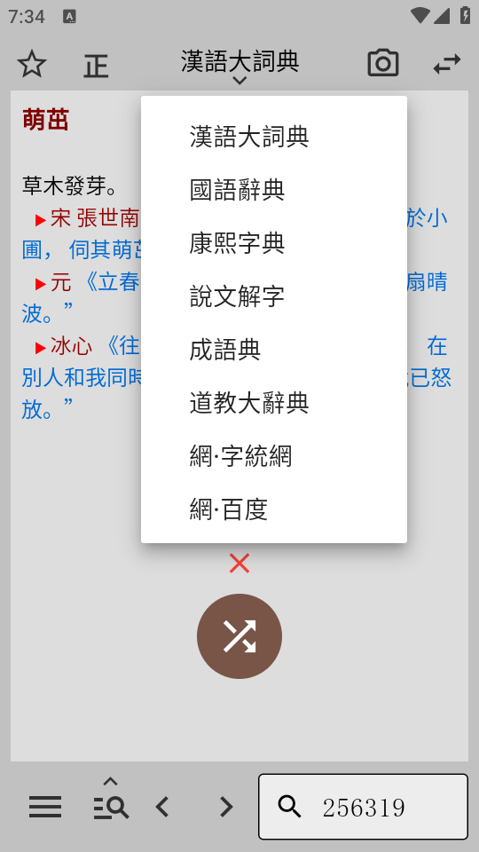
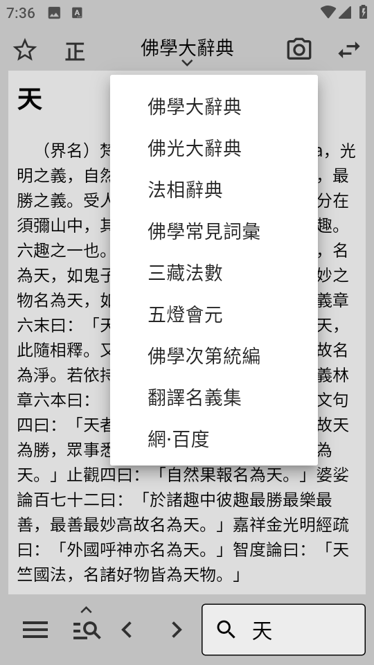
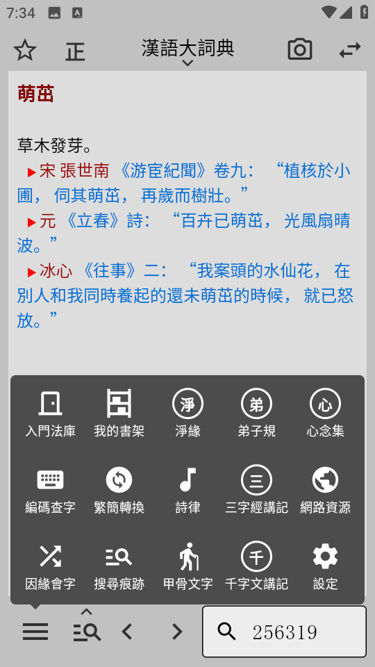

# sudict

素典flutter重製版本。

#### 先看幾張APP截圖






由於資源文件太大，無法上傳到gitee，所以請到騰訊微雲中下載資源進行編譯：
链接：[https://share.weiyun.com/4yUn3faJ](https://share.weiyun.com/4yUn3faJ)
有何疑問請到微信羣或QQ羣中聯繫我，或發郵件：414078791@qq.com。

#### Debug問題
```
1. dict_page_view_plugin或mdict_flutter_plugin由於更新與本地不符。
  1) flutter clean
  2) flutter pub get
  3) C:\Users\[你的用户名]\AppData\Local\Pub\Cache\git\[具體名稱]
     在此目錄執行 git pull origin master

2. windows下需要安裝 vcredist_x86、vcredist_x64
```

#### Build問題
```
1. 刪除 C:\Users\[你的用户名]\AppData\Local\Pub\Cache\hosted\pub.flutter-io.cn\pdfrx-0.4.10\android\.lib\latest
```

#### 待處理問題：
1. ios端未適配。
2. pc端未適配，webview相關問題、opencc等。
3. mdx讀取目前是使用開源JAVA，PC和IOS看起來需要用CPP開源版本。
4. 系統底部爲黑色。
5. 路由能支持返回時不刪除，繼續PUSH時，使用原有的UI。
6.  fishdict更多功能及文檔輸出==
7.  pdf閱讀器不能自右向左
8.  txt閱讀器
9.  djvu閱讀器


#### 隨喜捐助
> 微信  


> 支付寶


> 銀聯卡

賬號：6214850202162084
銀行：招商银行
姓名：林庆昌